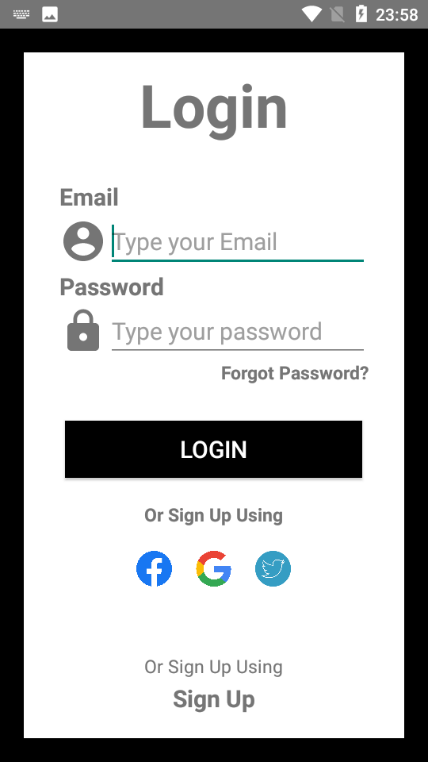
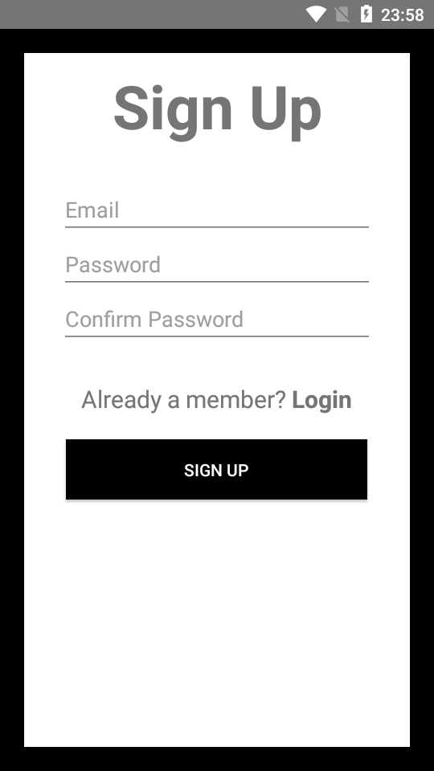
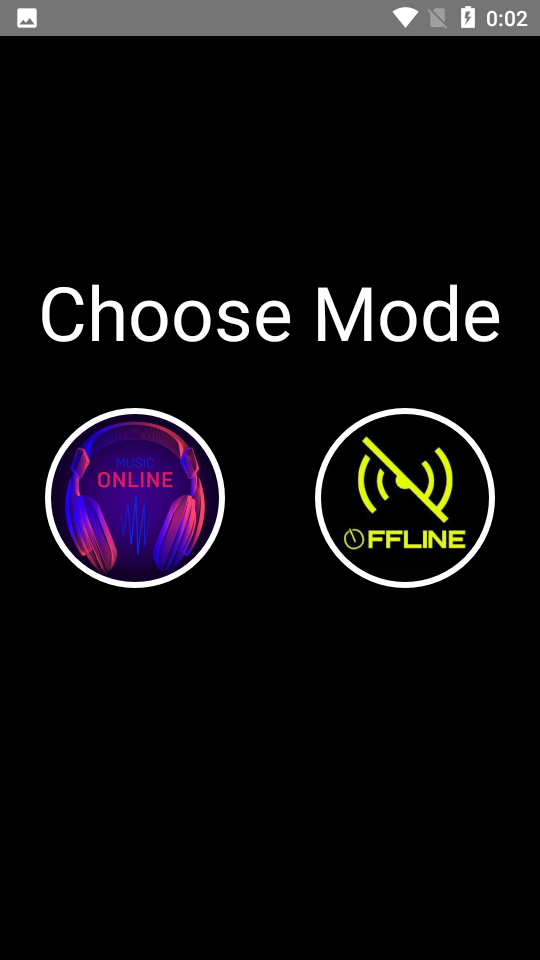
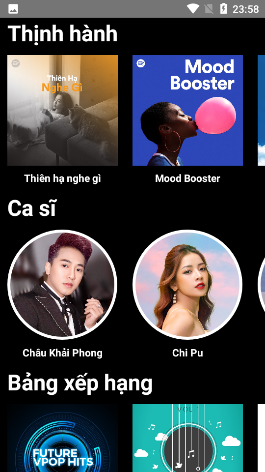
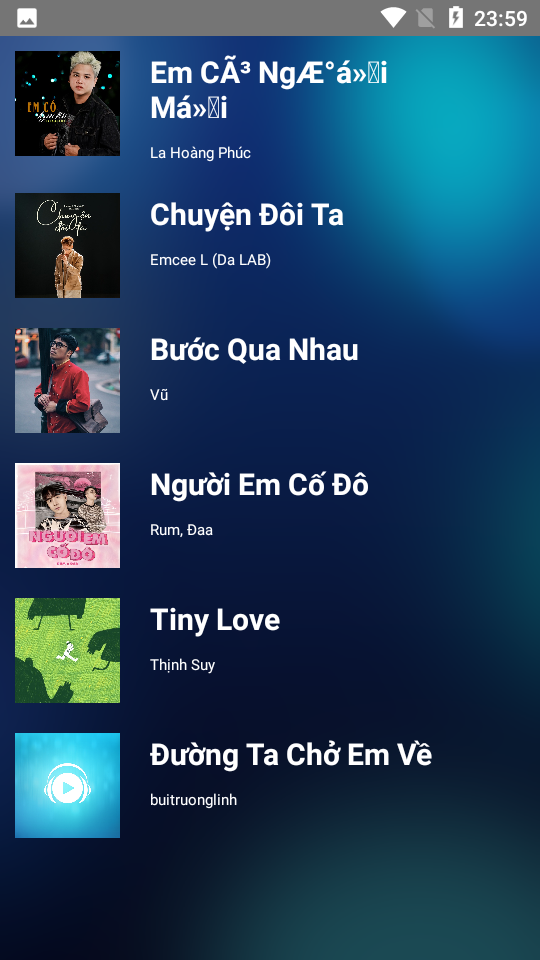
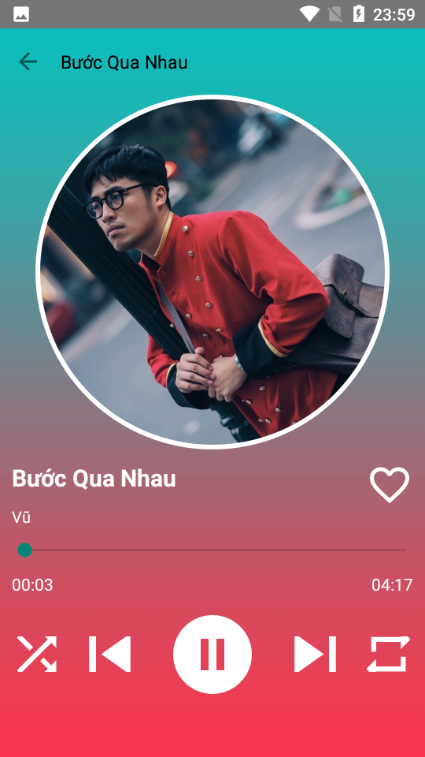

# MediaPlayerApp
This is the app that I and my friends developed in 2 months based on Spotify.We built this app all by ourselves and only took inspiration from the Spotify interface.

## Installation
1. Clone this repository and import into **Android Studio**:
```bash
git clone git@github.com:Megakawa/MediaPlayerApp.git
```
2. Connect your phone (Emulator is fine) (Android only)
3. Enjoy
## Configuration
## Generate apk release build
Follow instruction from [here](https://www.instamobile.io/android-development/generate-react-native-release-build-android/)
1. Generate a keystore

```bash
keytool -genkey -v -keystore your_key_name.keystore -alias your_key_alias -keyalg RSA -keysize 2048 -validity 10000
```

2. Adding Keystore to your project

```bash
mv my-release-key.keystore /android/app
```

3. Change [android/app/build.gradle](./android/app/build.gradle)
```
android {
....
    signingConfigs {
        release {
        storeFile file('your_key_name.keystore')
        storePassword 'your_key_store_password'
        keyAlias 'your_key_alias'
        keyPassword 'your_key_file_alias_password'
        }
    }
    buildTypes {
        release {
        ....
        signingConfig signingConfigs.release
        }
    }
}
```

4. Release APK Generation
```
cd android
./gradlew assembleRelease
```


## Enable Firebase support
1. [Add firebase to your android app](https://firebase.google.com/docs/android/setup)
2. [Create a Firebase Cloud Firestore database](https://firebase.google.com/docs/firestore/quickstart#create)
3. [Create a default Firebase Cloud Storage bucket](https://firebase.google.com/docs/storage/android/start#create-default-bucket)
4. [Create a Firebase Realtime Database](https://firebase.google.com/docs/database/android/start#create_a_database)
### NOTE

Edit **FIREBASE_DATABASE_URL** in [src/constants/index.ts](./src/constants/index.ts) to match your Firebase Realtime Database as noted in [here](https://rnfirebase.io/database/usage#references)

The offline feature is required you to create a folder for each music songs and named it exactly like the song's name. Then puts it to your local \Music folder.

## Generating signed APK
From Android Studio:
1. ***Build*** menu
2. ***Generate Signed APK...***
3. Fill in the keystore information *(you only need to do this once manually and then let Android Studio remember it)*

## Maintainers
This project is mantained by:
* [Megakawa](http://github.com/Megakawa)
## A little demo
1. App login screen:

   

2. App SignUp screen:

   

3. Choose Mode screen:

   

4. OnlineFeature Screen:

   
   
5. OnlineFeature ListSong Screen:

   
   
   
6. OnlineFeature PlaySong Screen:

   

7. OfflineFeature screen:

   

## Contributing

1. Fork it
2. Create your feature branch (git checkout -b my-new-feature)
3. Commit your changes (git commit -m 'Add some feature')
4. Run the linter (ruby lint.rb').
5. Push your branch (git push origin my-new-feature)
6. Create a new Pull Request
